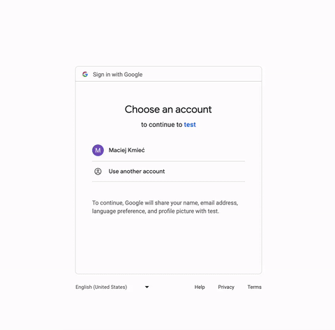

<a name="readme-top"></a>
[](https://choosealicense.com/licenses/mit/)


#

<div align="center">
  <a>
    
  </a>

  <h3 align="center">Cloud Storage Server</h3>

  <p align="center">
    A simple Flask server to upload and store multiple users' files, using OAuth for Google authentication.
    <br />
    <a><strong>Explore readme »</strong></a>
    <br />
    <br />
    <a href="https://github.com/mwkm00/server-storage/issues">Go to issues »</a>
  </p>
</div>

## Installation

_This project requires Python and some modules, for the full list check the <a href="https://github.com/mwkm00/server-storage/blob/experimental/requirements.txt">requirements.txt</a> file._

1. Clone the repository: 
   ```sh
   git clone https://github.com/mwkm00/server-storage.git
   ```
       
2. Install Python:    
   ```bash
   sudo apt install python3
   ```
   Windows: <a href="https://www.python.org/downloads/">Download Installer</a>    
        
3. (Recommended) install a fresh Python Virtual Enviroment in the project directory:
   ```bash
   python -m venv .venv
   ```    
   Remember to activate it before step 4.
       
4. Install the project's dependencies: 
   ```bash
   pip install -r requirements.txt
   ```
       
5. Set up your secret.env file:       
   It is necessary to store your **Google Cloud Client ID**, **Client Secret** and the **App Secret** in the **secret.env** file for the server to read them.
   Customize this dummy secret.env file with your own values:

   ```bash
   GOOGLE_CLIENT_ID="do-not"
   GOOGLE_CLIENT_SECRET="use-me"
   APP_SECRET="dummy"
   ```

   Do not share your **secret.env** file!
   <p align="right">(<a href="#readme-top">back to top</a>)</p> 
## Usage
   By default, the server is hosted locally, with the Flask debug feature turned on.
   
   Run the project: 
   ```bash
   python webserver.py
   ```
   Or set up the project for use of the _flask_ command in the terminal        
     
      
   Go to <a href="http://localhost:5000">http://localhost:5000</a> to log in using your Google account.     
   If port 5000 is already occupied, change the **app.run()** function call in **webserver.py** accordingly:
   
   ```bash
   if __name__ == "__main__":   
    if not os.path.isdir(UPLOAD_DIR):   
        os.mkdir(UPLOAD_DIR)   
    with app.app_context():   
        db.create_all()   
    app.run(debug=True) #, port=<new_port>) <--- CHANGE THIS VALUE   
   ```

## Purpose   
Although this project is a good starting point for anyone wanting to experiment with Flask and OAuth, __do not__ use it
or its design in a production enviroment. For now, it is a _mock project_ lacking many safety features.    

That much to say, with some GUI changes, it might serve as a great self-hosted home cloud or even (with some modification) a private over-the-internet cloud.   
    
Suggested improvements will be listed in the <a href="https://github.com/mwkm00/server-storage/issues">Issues</a> tab.       
    
For a very basic implementation, check out the <a href="https://github.com/mwkm00/server-storage/tree/legacy">Legacy branch</a>    

## Showcase
  <a>
    
  </a>

## Contributing
I would love for this project to become a playground for trying out and learning new things, so
contributions are very welcome!   
How you can contribute:   

1. Find or <a href="https://github.com/mwkm00/server-storage/issues">file an issue</a> you'd like to address. Please try to keep issues reasonably small, focusing on one aspect.

2. Create a new branch:
   ```sh
   git checkout -b your-fork-name
   ```
3. Make some changes and commit them to the branch:
   ```sh
   git commit --signoff -m 'changes description'
   ```
4. Push the branch to your fork on GitHub:
   ```sh
   git push origin your-fork-name
   ```  
5. Test your app:   
   ```sh
   pytest
   ```  
   Note, that currently implemented tests are **very** basic, for major restructuring they will
   require changes.
   Check the formatting:
   ```sh
   black --check .
   ```  

7. Make a pull request on GitHub to the <a href="https://github.com/mwkm00/server-storage/tree/experimental"><strong>experimental</strong></a> branch. Make sure to **#** the issue you are addresing

<p align="right">(<a href="#readme-top">back to top</a>)</p>

## License

Distributed under the <a href="https://choosealicense.com/licenses/mit/">MIT License</a>.
